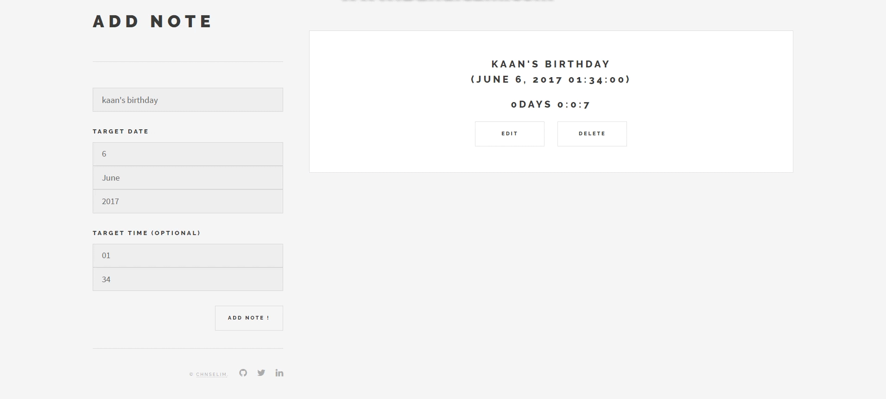

## JS - SIMPLE NOTES

Take notes & control them with timer.

[Demo](https://chnselim.github.io)

### Todo

- [x] Dynamically add notes
- [x] Filter with date & time
- [x] Delete notes
- [ ] Edit notes
- [ ] The target date TODAY/TOMORROW
- [ ] The target time NOW/ONE HOUR LATER
